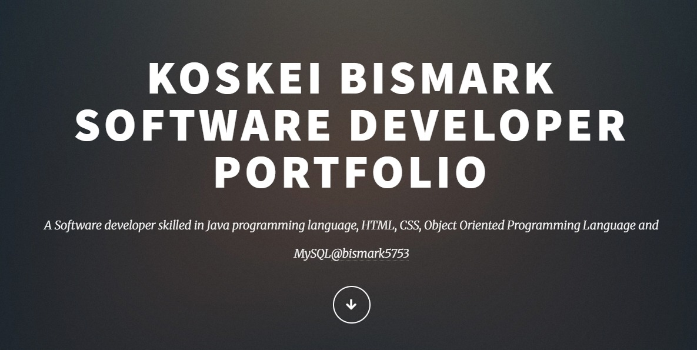

# Jackline & Bismark PLP Deskies | Full Stack Developers Portfolio

This is a personal portfolio website built with **HTML** and **CSS** showcasing the work, skills, education, and interests of two passionate full stack developers — **Jackline** and **Bismark**.

## Overview

The website includes:

- A hero section introducing us and what we do
- About sections for Jackline and Bismark with photos and tech stacks
- Education section with details and downloadable CVs
- Project highlights with screenshots and links
- Interests for both developers
- Contact form for feedback
- Clean and responsive design layout

## Tech Stack

- **HTML5** — for structure and content
- **CSS** — for layout and styling

## Files Included

- `index.html` — Main HTML file
- `styles.css` — Linked stylesheet for styling
- Image files (e.g. `jackline.jpg`, `Bismark.jpg`, project screenshots)

## Screenshots

##  Live Demo

Hosted using Github pages

## Authors

- **Jackline Kibiwot**
- **Bismark Koskei**

## License

This project is open for educational and personal portfolio purposes. All content @ 2025 Jackline & Bismark.
